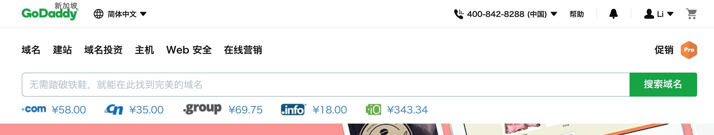
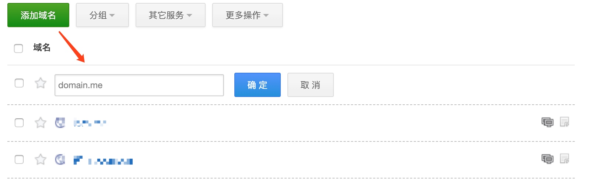
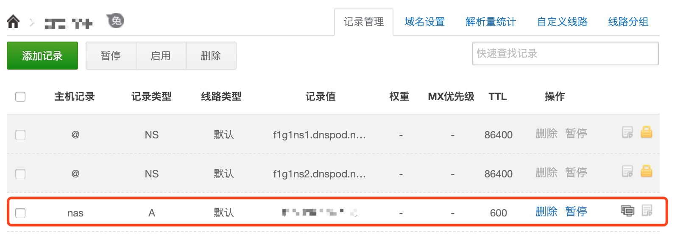
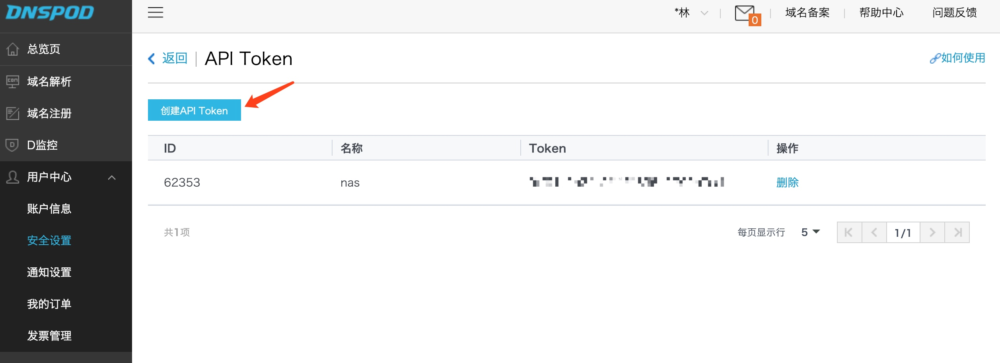
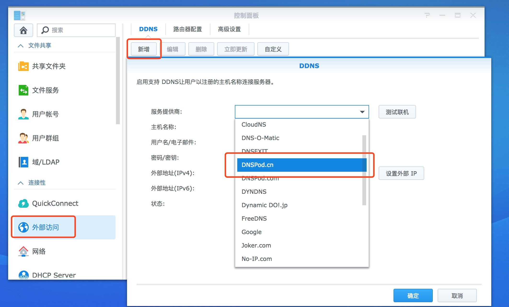
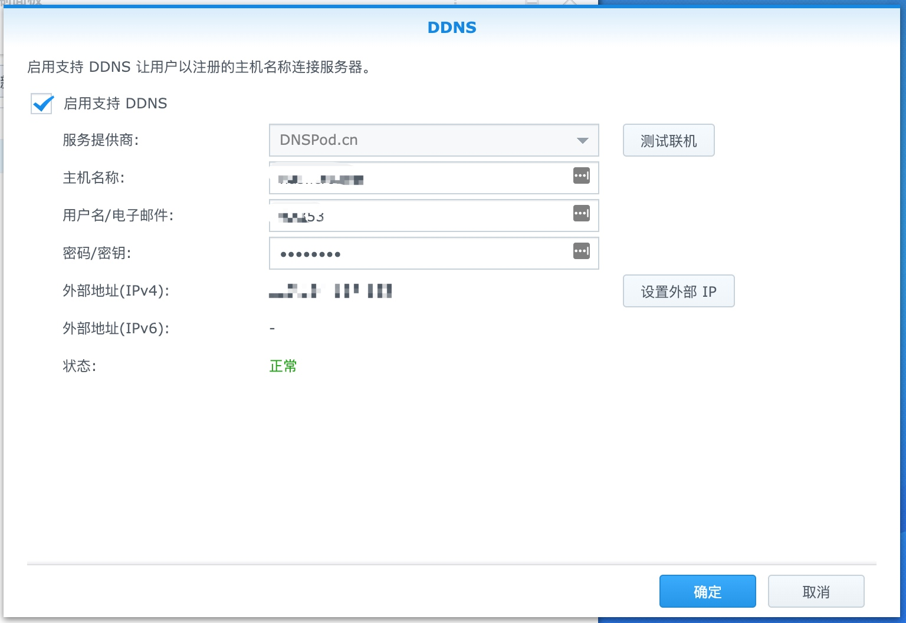

# 01 如何让你的群晖通过顶级域名外网访问

下面是笔者的使用环境:

* NAS: DS418play
* 带宽: 电信 200M
* UPS: APC 施耐德 BK650-CH
* 路由器: NETGEAR R7000

## 公网IP

打开光猫的后台管理地址，查看获取到的 IP 地址是否和 https://ip.sb/ 显示的地址是否一样。如果一样的情况下，一般为公网IP。 不一样的话，或者不是公网IP，请联系你的运营商客服，一般描述下你家需要安装监控视频之类的，都能被理解啦。

## 顶级域名

申请域名的渠道有很多: [阿里云的万网](https://wanwang.aliyun.com/)、[腾讯云](https://dnspod.cloud.tencent.com/)、[GoDaddy](https://www.godaddy.com/)等等。笔者是在GoDaddy购买的域名，申请步骤不阐述了，一步一步按照指定流程就能很方便搞定。

## DDNS

这里选择使用[DNSPOD](dnspod.cn)做域名的解析，至于什么是DDNS？请参考这篇文章-[DDNS的介绍](https://hsk.oray.com/news/3774.html)，而DNSPod是国内免费智能DNS解析服务商。

首先，选择「域名解析」栏，添加你申请的顶级域名:

进入添加域名的详细页面，新增以下一条记录: 

主机记录: 看自己的心情取一个方便记忆的;
记录值: 127.0.0.1

然后打开 [安全设置](https://www.dnspod.cn/console/user/security) ,选择 API Token 输入名称并创建。创建成功后会显示 ID 和 Token ，请务必复制并保存。

## NAS外部访问

接下来设置NAS的外部访问: 「控制面板」=> 「外部访问」，新增DDNS、选择DNSPod.cn。

设置对应参数:

* 主机名称：Dnspod 中新建的 A 记录子域名
* 用户名/电子邮件：创建 Api Token 成功后的 ID 值
* 密码：创建 Api Token 成功后的 Token 值

填写后点击测试 如果参数填写正确，提示正常。

刷新 Dnspod 控制台页面也会看到对应的子域名记录值已经不是 127.0.0.1，而且我们真实的公网 IP。当公网 IP 发生变化是，会自动更新子域名的记录值。这样只需通过子域名就可以访问到我们的设备。

done!

下一篇: 如何让你的顶级域名拥有SSL证书

