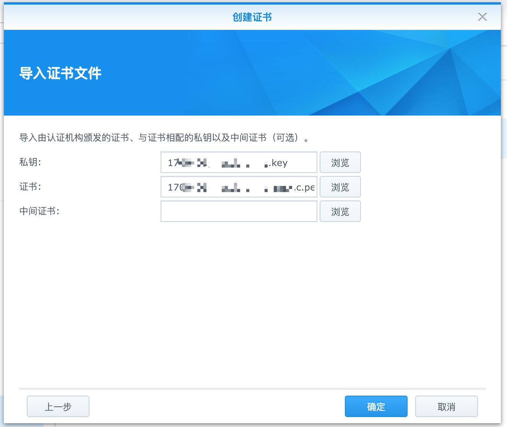

# 02 如何让你的顶级域名拥有SSL证书

主要步骤:

* 通过阿里云申请免费证书
* 导入群晖
* 测试

## 申请免费的阿里云证书

证书大部分都很贵，不过也有一些免费的证书服务供个人开发者使用，这是一个大好消息。比如腾讯云，七牛云，阿里云。这里拿阿里云来实践 - [地址](https://common-buy.aliyun.com/?spm=5176.2020520163.cas.1.2arDtO&commodityCode=cas#/buy)

选择上面的免费证书，一步一步的按步骤下去，购买成功后，进入证书控制台。

下一步，申请证书，因为我的域名解析在DNSPOD，还需要到DNSPOD添加DNS解析记录以验证信息:

然后，等待审核，一般等待几分钟就会审核通过。接下来下载证书，导入群晖。

## 群晖设置

下载证书，选择Apache类型:

解压，导入到群晖，「控制面板」 - 「安全」 - 「证书」导入:

最后修改默认的证书配置:

## 测试

在浏览器中访问你的nas顶级域名，之前是这样的:

现在不会再提醒你链接不安全啦:

done!

