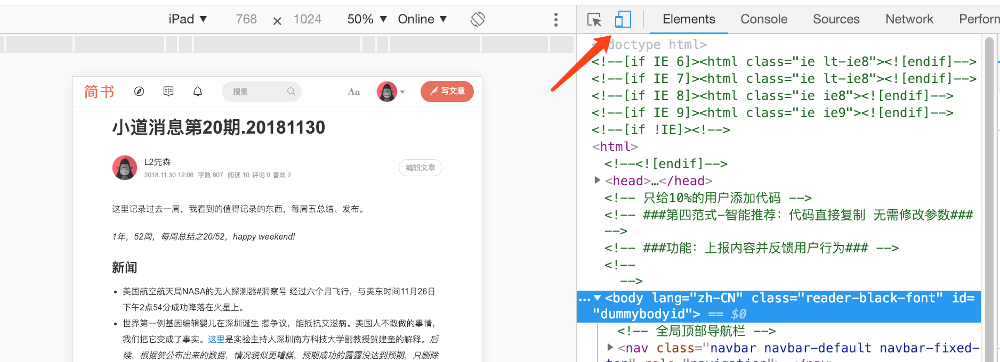
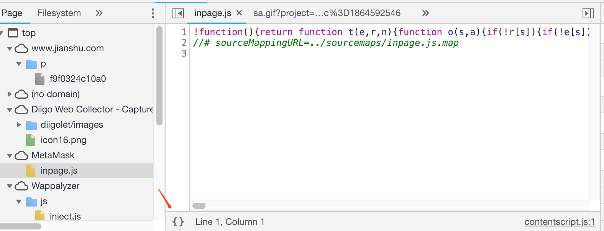
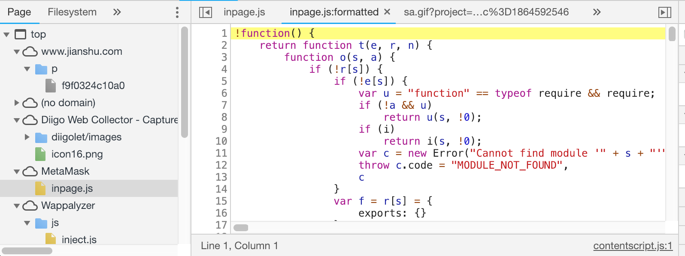
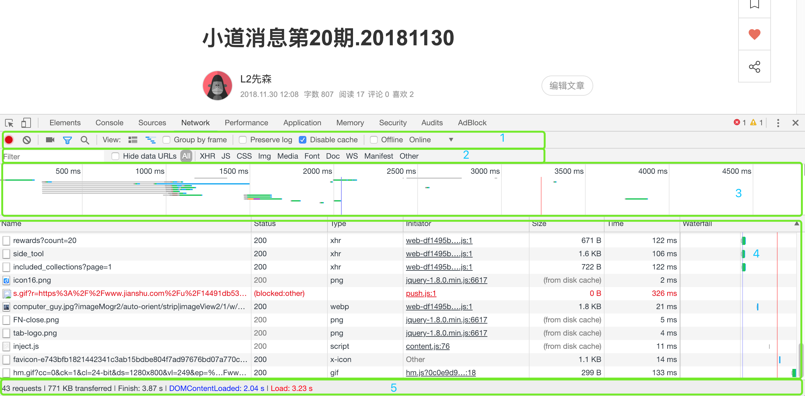
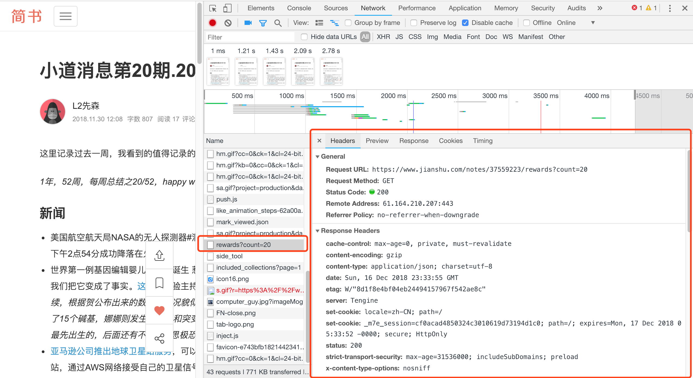

# Chrome开发者工具: 从小工到专家

本篇文章教你如何使用Chrome开发者工具，和网站的性能诊断。大部分内容都适用于Mozilla Firefox和Microsoft Edge开发者工具，这里使用的Chome版本是当前最新版本 - 71.0.3578.80，使用电脑是Mac。

首先，在Chrome浏览器中打开「开发者工具」的三种方式：

- 点击最右上方的「自定义及控制 Google Chrome」(三个垂直点) > 更多工具 > 开发者工具
- 快捷键方式: ⌘ + Option + I 鍵
- 选中页面中任何元素，右击 > 检查

接下来，我们来看「开发者工具」中的各个面板。

## Element(元素面板) - 网页的布局、DOM

通常开发者在「Element」面板中查看、修改网页的DOM(文档对象模型)。Element面板对开发者的帮助有以下三点:

- 检查网页上任何部分的DOM内容
- 浏览网页的整体DOM结构和HTML
- 修改HTML/CSS的操作，直接应用到网页，查看实际效果。这一点在开发和测试环节非常重要。

左边栏，我们可以查看网页的HTML和DOM树结构中的任何一个元素，可以对元素进行编辑，并实时查看网页的变化。在「Element」的右边栏，我们可以查看HTML元素的样式，并可以启动/禁用元素的样式。右边栏的「Computed」是查看元素的最终样式结果。「Event listeners」是元素的时间侦听器。

「ELement」中最常使用的是：检查网页元素的HTML和DOM，以及样式。最简单的方式是，选中网页中需要检查的元素，右击→检查，弹出了「Element」面板，并会高亮显示相应的HTML。另一种方式是，通过鼠标悬浮来查看HTML元素，同时还能显示margin(绿色)和padding(黄色)的数据，然后通过面板了解HTML元素的更多信息。

Bonus tip: 在Style面板中，通过选中‘:hov’可以方便地查看HTML元素的悬浮交互样式。

## Toggle device toolbar - 检查网页的适配性

Chrome开发者工具还为创建响应式网站，提供了「」(左上方)来模拟网页在不同终端渲染的结果，比如: iPhone, iPad 和 Nexus...

## Source - JS代码调试

Chrome开发者工具中最常用的面板用于分析、调试和编辑网页的JavaScript, HTML, CSS。「Sources」面板组织管理从网页的域获取各种资源，被压缩的文件可以通过‘去混淆’来重新格式化展示出来，具体操作见下面的图片：

另外，代码也可以直接在「Source」面板修改。

「Sources」面板通过提供可用于设置“断点”的内置调试器来启用JavaScript调试。在断点处，可以通过按'Esc'键在小窗口中打开console面板来调查各种变量的值。根标准调试器中一样，可以使用诸如单步执行、单步执行和单步执行等各种选项。还包含的其他特性：

- 在任何错误发生时，启用断点
- 调用堆栈
- 各种类型的断点，如事件侦听器断点(如单击)或DOM断点(如修改树)。

## Network - 了解请求和下载的资源文件并优化网页加载性能

网络面板记录页面上每个网络操作的相关信息，包括详细的耗时数据、HTTP 请求与响应标头和 Cookie等等。每一个请求的参数(body、header、params)都会被记录下来，并且可以使用网络面板筛选需要查看的网络请求。

网名面板有5个窗格组成:

- Controls: 可以控制 Network 面板的外观和功能。
- Filters: 可以控制在 Requests Table 中显示哪些资源。提示：按住 Cmd (Mac) 或 Ctrl (Windows/Linux) 并点击过滤器可以同时选择多个过滤器。
- Overview: 显示了资源检索时间的时间线。如果您看到多条竖线堆叠在一起，则说明这些资源被同时检索。
- Requests Table: 列出了检索的每一个资源。此表格按时间顺序排序，最早的资源在顶部。点击资源的名称可以显示更多信息。 提示：右键点击 Timeline 以外的任何一个表格标题可以添加或移除信息列。
- Summary: 此窗格可以一目了然地告诉您请求总数、传输的数据量和加载时间。

**捕捉屏幕截图**: Network 面板可以在页面加载期间捕捉屏幕截图。此功能称为幻灯片。点击摄影机图标可以启用幻灯片。图标为灰色时，幻灯片处于停用状态 (已停用幻灯片)。如果图标为蓝色，则说明已启用 (已启用幻灯片)。

**load事件的触发**: 

- Overview 窗格中的红色竖线表示事件。
- Requests Table 中的红色竖线也表示事件。
- 在 Summary 窗格中，您可以看到事件的确切时间。

**查看单个资源的详细信息**:

点击资源名称（位于 Requests Table 的 Name 列下）可以查看与该资源有关的更多信息。可用标签会因您所选择资源类型的不同而不同，但下面四个标签最常见：

- Headers：与资源关联的 HTTP 标头。
- Preview：JSON、图像和文本资源的预览。
- Response：HTTP 响应数据（如果存在）。
- Timing：资源请求生命周期的精细分解。

Bonus tip: 右击选中某个网络请求，选中copy → copy as cURL，可以在终端粘贴copy的内容，用终端来访问了。

## Application - 使用应用面板检查加载的所有资源

从 Application 面板检查和管理存储、数据库与缓存。

- 查看和修改本地存储与会话存储。
- 检查和修改 IndexedDB 数据库。
- 对 Web SQL 数据库执行语句。
- 查看应用缓存和服务工作线程缓存。
- 点击一次按钮即可清除所有存储、数据库、缓存和服务工作线程。

## Console - 使用控制台面板记录诊断信息

控制台面板可以被认为是一个实验性的游乐场。 您可以运行任何类型的JavaScript代码来访问全局窗口变量。 控制台面板还可用作所有类型错误（网络和源代码相关）的记录器，并在网站或发生错误的源代码中的行号显示在一个位置。 此外，在调试期间，可以打开控制台面板以检查当前断点处的局部变量的值。 控制台面板公开一个对象“控制台”，可用于以不同格式记录信息。

## 扩展

Chrome开发者工具可以很容易地扩展为不同的目的创建扩展，然后可以添加为新的面板。例如，流行的devtools扩展包括AngularJS的扩展，React。有关扩展devtools的更多信息，请参阅谷歌开发人员网站上的[这篇文章](https://developer.chrome.com/devtools/docs/integrating)。

参考文章:

- [chrome-developer-tools-to-master](https://apsdehal.in/blog/chrome-developer-tools-to-master)
- [Chrome DevTools](https://developers.google.com/web/tools/chrome-devtools/)

