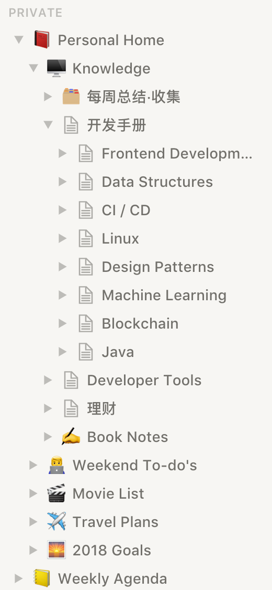

# 作为一名Dev，我是怎么整理归纳知识(信息)碎片

软件开发、尤其互联网是一个高速发展的领域，作为开发工程师，持续学习是必不可少的。现在的学习方式也不再是单一的，通过书籍或教材阅读这样一种方式了，我们会在互联网上浏览stackoverflow、Twitter、google、Hacker News以及其他专业的网站和社区，就能从文章、博客、代码片段获得大量有用的信息。

有太多的信息来源，保存和组织这些信息将是一项困难的事情。下面的内容中，我将介绍一些本人用来做这件事的工具。

我不在特定的平台上来管理我的知识，但使用的工具都允许以Markdown和HTML等标准导出数据。

另外，我的工作方式不一定适用与你，并且本人也还在寻找新的工具来优化我的工作方式。毕竟每个人都不一样，所以你是怎么收集知识的，欢迎向我推荐有用、有趣的工具: )

## NotionHQ

知识管理最基本部分是要拥有个人知识库，或者是Wiki。你可以有组织的方式保存链接、书签、备注等。

我用[NotionHQ](https://www.notion.so/?r=77413ac0e4e24729b3808b4afa661107)来构建个人知识库，用它来记录各类主题，按不同标签给不同优秀内容、教程分组，甚至我还使用NotionHQ来管理旅游计划、目标实践等，差不多管理了我的个人生活。

Notion的创新，也是我最喜欢的功能是，把文件、任务、知识库无缝重组。同时网页版、MacOS, Windows, iOS, 安卓都支持!

下面是我的“Personal Home”空间的层级页面:

Notion还有其他很有用的功能，比如集成电子表格、数据库和任务板。

若你也想使用Notion的话，你需要订阅付费个人计划，当然也有免费计划，就是功能有些局限。当然你可以使用这个[邀请码](https://www.notion.so/?r=77413ac0e4e24729b3808b4afa661107)注册，可以获得$10，够试用2个月。

其他可以替代的免费工具有: [VuePress](https://vuepress.vuejs.org/) or [GitBook](https://www.gitbook.com/?t=1)

## Pocket: 收集网上文章

[Pocket](https://getpocket.com)是本人最喜欢的工具之一！有了Pocket，你就可以从网上创建一个文章阅读列表。

每当我看到一篇看起来很有趣的文章，我就用Chrome扩展把它保存到口袋里。稍后，我将阅读它，如果我觉得它足够有用，我将使用Pocket的“Archive”功能永久保存那篇文章并清理我的Pocket inbox。

我尽量使阅读清单足够小，并将我处理过的信息归档。Pocket允许你标记文章，这将使以后搜索特定主题的文章更简单。

## SnippetStore: 代码片段管理神器

从GitHub，到Stack Overflow，到博客帖子，通常会找到一些不错的代码片段，希望稍后保存。它可以是一些很好的算法实现，一个有用的脚本或者一个如何用Y语言做X的例子。

[SnippetStore](https://github.com/ZeroX-DG/SnippetStore)是一个开源的代码片段管理应用程序。您可以根据语言或标记组织片段，并且可以有多个文件片段。它并不完美，但它完成了工作，更喜欢用更简单的方式组织SnippetStore的内容。

## DevHints: 速查表

[Devhint](https://devhints.io/)是Rico Sta创建的备忘单的集合。它是开源的，由Jekyll提供动力，Jekyll是最流行的静态站点生成器之一。

备忘单是用Markdown编写的，带有一些额外的格式化工具，比如对列的支持。

由于它是开源的，你可以创建自己的fork，删除了一些不需要的备忘单，并添加了更多的自己备忘单。

我使用备忘单作为如何使用一些库或编程语言或记住一些命令的参考。拥有单个页面非常方便，例如具有特定编程语言的所有基本语法。

我还在试验这个，但到目前为止效果很好。

## Diigo

[Diigo](https://www.diigo.com/index)允许您注释和突出显示网站的部分内容。在学习新话题时，我用它来注释重要信息。

---

有些工具在功能方面可能有一些重叠，但正如我在开始时所说的，这是一个不断发展改进的工作方式，我还在尝试和寻找改进和提高生产力的方法。

你呢？如何组织你的知识？请随意跟我交流。