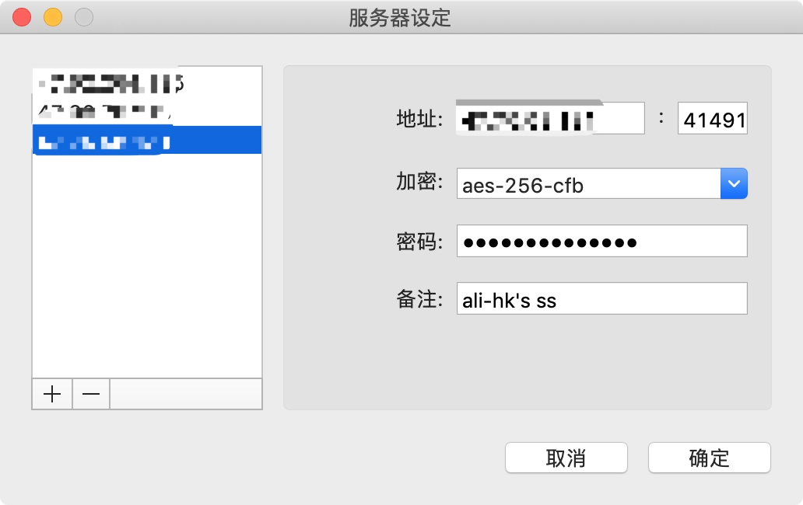
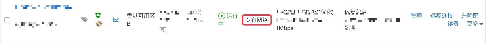
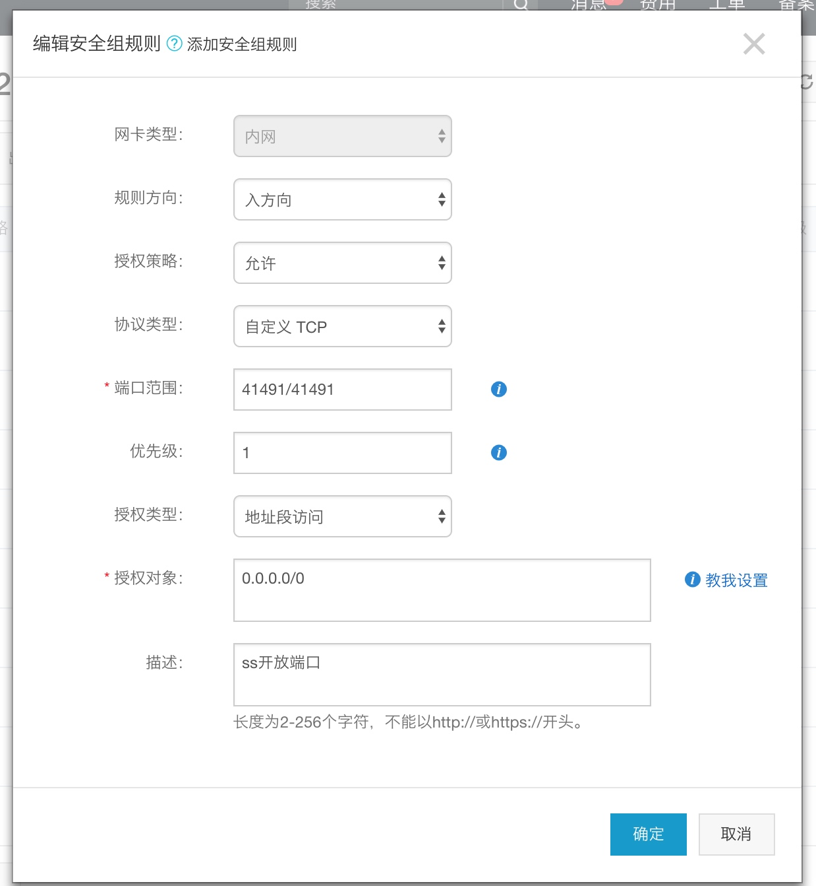

# 科学上网的解决方案之一: 在阿里云ECS(香港)搭建shadowsocks

下面是介绍如何在 阿里云ECS(香港)Centos7服务器搭建shadowsocks，搭建成功并能正常科学上网，本人亲测可用。

## 0. 准备环境

准备一台服务器(centos7)，在阿里云`全民云计算`购买一台入门级1核1G，一年花费293元，三年的话879元，足够用于搭建shadowsocks了。
本地客户端(本人的)：Mac系统 和 [shadowsocks](https://github.com/shadowsocks)

## 1. 安装Shadowsocks服务端

登录服务器 ==> 更新包 ==> 安装pip ==> 安装Shadowsocks

```
[root@*** ~]# yum update
[root@*** ~]# yum install python-setuptools && easy_install pip
[root@*** ~]# pip install shadowsocks
```

## 2. 配置Shadowsocks

```
touch /etc/shadowsocks.json
vim /etc/shadowsocks.json
> {
>  "server":"your_ip",
>  "server_port":41491,
>  "password":"yourpassword",
>  "timeout":300,
>  "method":"aes-256-cfb",
>  "fast_open":false,
>  "workers": 1
> }
```

## 3. 启动shadowsocks

```
[root@izj6c4ry7519t8rkroriqwz ~]# ssserver -c /etc/shadowsocks.json -d start
INFO: loading config from /etc/shadowsocks.json
2018-11-04 11:38:08 WARNING  warning: your timeout 3000 seems too long
2018-11-04 11:38:08 INFO     loading libcrypto from libcrypto.so.10
started
```

修改配置信息之后，需要重启的命令:

```
ssserver -c /etc/shadowsocks.json -d restart
```

## 4. 设置开机自启动

```
vim /etc/rc.d/rc.local
> /usr/bin/ssserver -c /etc/shadowsocks.json -d start
chmod +x /etc/rc.d/rc.local
```

## 5. 客户端配置




## 6. 阿里云的限制设置

一些注意事项:

* 服务器是专有网络的话，/etc/shadowsocks.json 中的server ip 是私有ip,而非公网ip。




* 开放端口设置

/etc/shadowsocks.json 中开放的端口需要 运行命令开放

> iptables -A INPUT -p tcp --dport 41491 -j ACCEPT

* 添加安全组规则

服务器实例的安全组规则需要增加 自定义 TCP 在 相关端口（41491） 的访问 ,（允许所有ip访问，设置为0.0.0.0/0），如下图：



最后测试，telnet your_ip 41491验证，访问正常的话，才能正常的使用shadowsocks!


