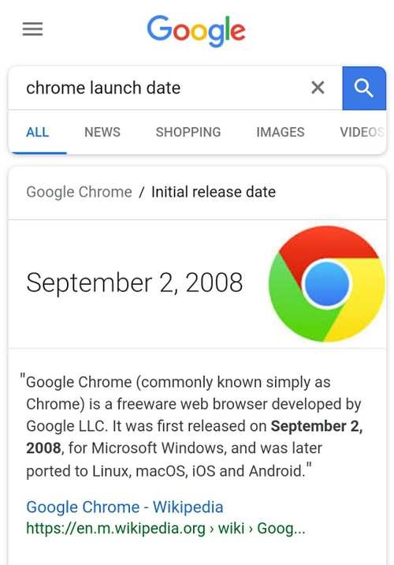

# 小道消息第8期.20180907

*注: 本专刊更名为 `小道消息`。(散花)*

这里记录过去一周，我看到的值得记录的东西，每周五总结、发布。

## 新闻

* [Google Chrome 10岁生日](https://www.blog.google/products/chrome/chromes-turning-10-heres-whats-new/amp/): 十年来，这个项目带动了无数创新，让互联网产生了天翻地覆的变化。十年前，主流浏览器还是 IE6，JS 仍然是一种玩具语言，一大堆无法调试的运行时错误。谷歌决定做自己的浏览器，为此特别开发了底层引擎 V8。发布的那天，所有人都震惊了，原来JS可以运行得这么快...... 后来，V8 导致了 Node 的诞生，Chrome 导致了 Electron 和 ChromeOS。
* [超越金融，AI成为全球薪资最高行业](): 据市场研究机构 Gartner 预测，人工智能将会让就业机会变得更多，而不是更少。到 2020 年，人工智能将会减少 180 万个工作岗位。但同时也创造了 220 万个工作岗位。
* [阿拉丁发布 8 月期小程序行业报告](https://readhub.cn/topic/2TGN59QK1i2?from=mp): 通过统计平台，也能帮你找到你需要的微信小程序: )
* [亚马逊盘中市值一度突破 1 万亿美元](https://readhub.cn/topic/1mtJla61Inr?from=mp): 股价一度达到 2050.50 美元，成为继苹果之后第二家市值破万亿美元的美国公司。
* [快播破产清算 王欣被爆再次创业 投身区块链行业](http://www.twoeggz.com/news/10721198.html): 这里简要介绍了快播的发展历史。
* [欧盟](https://www.theguardian.com/world/2018/aug/31/eu-recommend-member-states-abolish-daylight-saving-time)建议成员国取消夏令时。目前，所有28个欧盟成员国被要求在3月的最后一个星期天将时钟拨快一小时，并在10月的最后一个星期天拨慢一个小时。

## 教程

* [React-Router v4入门教程](https://medium.com/@pshrmn/a-simple-react-router-v4-tutorial-7f23ff27adf): React Router V4相对V2/V3几乎完全重写了，遵循 Just Component 的 API 设计理念。这篇文章简单地介绍了V4版本。还可以参考 [官网提供的Demos](https://reacttraining.com/react-router/web/example/basic)
* [现代 JS 流程控制：从回调函数到 Promises 再到 Async/Await](https://www.sitepoint.com/flow-control-callbacks-promises-async-await/): [译文地址](https://github.com/OFED/translation/issues/4)
* [Java面试：投行的15个多线程和并发面试题](http://www.importnew.com/29562.html): 多线程和并发问题已成为各种 Java 面试中必不可少的一部分。如果你准备参加投行的 Java 开发岗位面试，比如巴克莱银行（Barclays）、花旗银行（Citibank）、摩根史坦利投资公司（Morgan Stanley），你会遇到很多有关多线程的面试题。多线程和并发是投行面试的热门知识点，尤其是在面试有关电子交易开发工作时，他们喜欢用棘手的 Java 线程面试题轰炸面试者。他们希望确保面试者对 Java 多线程和并发有扎实的知识基础，因为他们大多数关注高性能带来的竞争优势。 -- 推荐书籍《Java 并发编程实践》
* [ECMAScript 6 入门](http://es6.ruanyifeng.com/): 本书覆盖 ES6 与上一个版本 ES5 的所有不同之处，对涉及的语法知识给予详细介绍，并给出大量简洁易懂的示例代码。
* [JavaScript 教程](https://wangdoc.com/javascript/): `ECMAScript 6 入门`是中级难度，适合已经掌握 ES5 的读者，那ES5 就看这本教材。
* [openvim](https://www.openvim.com/): 如果你还没有入 VIM 党，这是天赐良机。OpenVIM提供了在线交互教材，轻松上手编辑器之神。

## 资源

* [Uber开源分布式性能分析器JVM Profiler](https://github.com/uber-common/jvm-profiler): 最近，Uber 开源了一个分布式性能分析器，名为 JVM Profiler。
* [中国独立 iOS 和 macOS 开发者图鉴](https://josephchang10.github.io/chinese-indie-hackers/): 独立开发者 app 审核不通过，所以用 Vue 撸了个网站，收录了中国 iOS 和 macOS 共 91 位独立开发者的 310 款作品，按照更新顺序排列，每位作者基本上都提供了微博或 GitHub 等联系方式，网站开源挂在了 GitHub Pages 上。 
* [支付人必读：一文彻底搞清楚银联和现代支付系统运行过程](https://mp.weixin.qq.com/s/Fm7d7HhnTWd9k9cLKnrfjg): 彻底了解中国支付清算系统。
* [JCSprout](https://github.com/crossoverJie/JCSprout): 一个收集 Java 核心知识的中文库。
* [PublicWWW](https://publicwww.com/): 一个网页源码的搜索引擎，可以搜索哪些网页使用 react.min.js，或者服务器是 `"Server: nginx/1.4.7" `。

## 工具

* [cookiepedia](https://cookiepedia.co.uk/website/www.jd.com): cookiepedia是一个分析Cookie的在线工具，可视化显示某个网站留下的所有Cookie。这里是京东主页设置的22个Cookie。
* [virustotal](https://www.virustotal.com/#/home/upload): Virus Total是一款非常实用的可疑文件网络分析服务，通过各种知名反病毒引擎，对用户所上传的文件进行检测，以判断文件是否被病毒，蠕虫，木马...
* [codesandbox.io](https://codesandbox.io/dashboard/recent): codesandbox.io 是一个前端代码的在线编辑器，支持各种不同的框架，可以随时预览代码的运行结果。
* [Mithril](https://mithril.js.org/): Mithril 是一个类似 React 的轻量级前端端架，比 React 简单。主要特点有两个：一个是路由、状态管理、fetch 这些主要功能都内置了，二是体积很小（8kb）。

## 文摘

* 伟大的文明会崩溃，技术也会倒退。罗马帝国灭亡后，欧洲的技术水平大大倒退，停滞发展了1000年。这样的事情，如今也不是没有可能发生。  -- TIm O'reily《未来地图》

## 新奇

* [Windows 95 被做成了一款 app，我们在 MacBook 上体验了它](https://github.com/felixrieseberg/windows95): 即点即开，安装和使用比虚拟机简单多了。

你可能听说过 Windows 98，但你听说过 Windows 95 吗？

Windows 95 是微软第一代 Windows 9x 系操作系统，同时也是奠定微软操作系统霸主地位的重要产品。

时隔二十多年后，国外一名开发者 Felix Rieseberg 成功地将 Windows 95 操作系统做成了一个 app，并免费共享给所有希望尝鲜 Windows 95 的用户。是的，你现在就可以在 Windows 10、Linux 以及 macOS 等平台上安装 Windows 95。

现在 Felix 已经在 Github 上发布了「app 版 Windows 95」的 app 安装包以及源代码，你可以前往 Github 下载，并在任何电脑（包括 Windows、Linux、macOS 以及 Debian（含 Ubuntu）等系统的电脑）上运行 Windows 95。

值得一提的是，这个「app 版 Windows 95」并未获得微软授权，开发者 Felix 也在 Github 中标注，仅供学习交流用途。

