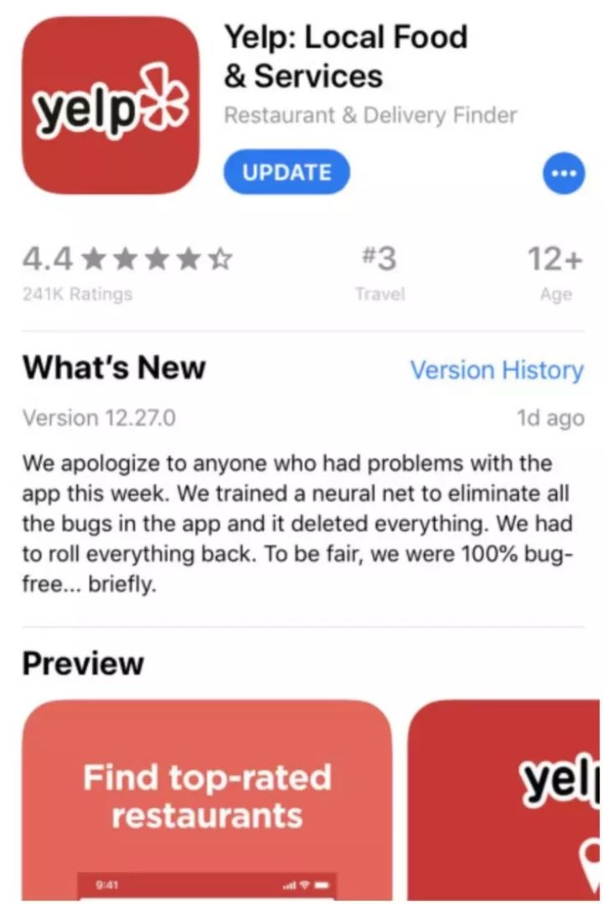

# 每周分享27期.20190118

这里记录过去一周，我看到的值得记录的东西，每周五总结、发布。

*1年，52周，每周总结之27/52，happy weekend!*

## 新闻

* [今年将有 30 多款 5G 设备推出，成为「5G 年」](https://readhub.cn/topic/7JhVTnpMnj1): 预计将有逾 30 款 5G 设备在今年推出，多数是智能机。
* [世道变坏，从颠覆微信开始](https://mp.weixin.qq.com/s/1H4LUxNi8UysdhGXGfoQ0w): 1 月 15 日，三家有头有脸的公司或人物，选择在这一天发布，而且都是社交产品，矛头全都瞄准微信，大有颠覆微信之势。
* [外星人又刷屏了](https://www.cnbeta.com/articles/science/807473.htm)……昨天媒体报道科学家发表论文称“宇宙深处检测到神秘电波信号”，大家就开始热烈讨论宇宙深处神秘信号到底要不要回应？
* [Jest团队宣布将从Flow转向TypeScript](https://github.com/facebook/jest/pull/7554)，FaceBook自家的产品都不用Flow，看来Flow是真的要停止开发了。
* [《Steam：回顾 2018》](https://steamcommunity.com/groups/steamworks/announcements/detail/1697194621363928453): 回顾了今年Steam平台的发展轨迹，从各种新系统策略 部署到对玩家社区的沟通方式改进“Steam聊天”。
* [PYPL 1 月 IDE 指数榜单](http://pypl.github.io/IDE.html)已发布，前三名依然是 Visual Studio、Eclipse 和 Android Studio 。

## 教程

* [CI与CD的区别](https://thenewstack.io/understanding-the-difference-between-ci-and-cd/?utm_source=wanqu.co&utm_campaign=Wanqu+Daily&utm_medium=website): Continuous Integration/Delivery不在于用了什么工具，而在于思想、流程。
* 麻省理工学院最新的编程教程是[《如何设计程序》(第二版，缩写为HTDP)](https://htdp.org/2018-01-06/Book/index.html)，以前著名的SICP现在已经不用了。
* [现代浏览器的工作原理](https://developers.google.com/web/updates/2018/09/inside-browser-part1?utm_source=wanqu.co&utm_campaign=Wanqu+Daily&utm_medium=website): 来自 Google 官方博客。图文并茂地很 high level 地解释了 Chrome 的多进程架构。
* [什么是真正的程序员](https://www.cnblogs.com/xueweihan/p/5220513.html): 本文是一篇译文，作者仿照《小王子》中的情节，通过小 printf 遇见的不同类型的程序员，最后悟出什么才是真正的程序员！

## 资料

* 2019年度SEE Conf体验技术大会和D2前端技术论坛，全部PPT下载地址: [SEE Conf](https://www.yuque.com/seeconf/content/kbnzac)、[D2](https://www.yuque.com/d2forum/content/d213)
* [专为程序员编写的英语学习指南](https://a-programmers-guide-to-english.harryyu.me/): 一位程序员的学习英语之路，花费了超过 20 个小时，跨度 19 天完成这份指南。
* [developer-roadmap](https://github.com/kamranahmedse/developer-roadmap): 本篇教程是一组图表，展示成为前端、后端或devops，可以采取的路径和希望采用的技术路径。
* [现在最流行的网站技术栈是什么？](https://news.ycombinator.com/item?id=18829557): 这是一个论坛的讨论帖，有人问这个问题，下面一堆回答，流行的技术基本上都提到了。
* [Better Dev 周刊](https://betterdev.link/): 每周一期的开发者周刊
* [3Blue1Brown 视频的中文官方账号](https://space.bilibili.com/88461692/video): 3Blue1Brown 是著名的数学科普视频制作者。
* [12 款助你学编程的免费游戏](https://zhuanlan.zhihu.com/p/23936161): 本文中，我们评选出12个热门网站，你可以通过玩游戏学习编程。

## 工具

* [临时Windows系统](https://demo.glyptodon.com/#/client/ZGVtbwBjAGRlbW8=): 一个网站，可以临时生成一个Windows系统，免费试用15分钟，还可以访问Google/Youtube网站。
* [super-inspire-end](https://github.com/super-inspire/super-inspire-end): 在不到30s内得到一个干净的开箱即用的临时linux系统.
* [数字绘](https://www.myshuju.net/Home)是一款可以绘制线框图、流程图、网络图、组织结构图、UML、BPMN 等各种图表的在线工具，这是一个一言不合就自动动手造轮子的故事。开发者 @zxhm 是一个不愿意用盗版 Visio，又嫌弃 ProcessOn 有点贵，然后觉得 draw.io 没有云储存比较烦，于是自己就使用开源技术制作了一个。
* [keyzen](https://wwwtyro.github.io/keyzen/): 测试打字速度的工具。

## 新奇

* [Yelp为了减轻工程师的fix-bug负担，训练AI做Debug工作，让AI来干掉Bug，结果它把所有代码都删了](https://www.news18.com/news/buzz/yelp-tried-to-remove-bugs-on-app-artificial-intelligence-deleted-everything-2003957.html): AI编程还有很长的路要走啊。

