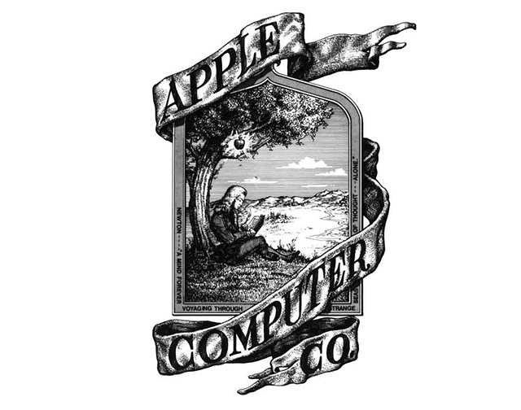

# 每周总结第6期.20180824

这里记录过去一周，我看到的值得记录的东西，每周五总结。

1976年，苹果公司成立时的第一个 Logo，是牛顿坐在苹果树下面。很快，乔布斯就用咬了一口的苹果，取代了这个 Logo。

## 新闻

* [南极血瀑](https://motherboard.vice.com/en_us/article/7xq7ba/scientists-finally-solved-the-mystery-of-antarcticas-blood-falls): 科学家早就发现，南极冰川上流淌着血红的液体，被称为"南极血瀑"。这些红色液体是从哪里来的？最近终于找到了答案。原来冰川的下面有一个地下湖，水质含有大量的铁元素，因此呈现红色。冰川的挤压作用，将地下水挤到了冰川表面，形成了血瀑。
* [智能音箱Echo被腾讯攻破，秒变监听器](https://time.geekbang.org/column/article/13997): 近日，在全球最大的黑客盛会 DefCon 安全会议上，腾讯的研究人员演示了如何利用 Echo 第二代智能音箱的漏洞，神不知鬼不觉地在后台对用户进行监听，或者是控制音箱播放的内容。
* [i背调完成数千万元A+轮融资](https://www.chinaventure.com.cn/cmsmodel/news/detail/331032.shtml): 自动化背景调查公司i背调宣布完成数千万元A+轮融资。猎聘、北森等第三方人力资源平台将i背调SDK或API嵌入其平台后，则一站式地向其客户提供高关联度的背调服务。(注: 前同事的公司)

## 教程

* [GitHub最新推出四门课程](https://time.geekbang.org/column/article/13696): 在今年早些时候，GitHub 推出了 Learning Lab 计划，旨在帮助各个技能水平层次的人使用 GitHub。之前推出的课程包括 GitHub 入门、使用 Markdown、管理合并冲突和 GitHub Pages，最近，GitHub 又推出了四门新课程，包括上传到 GitHub、迁移到 GitHub、社区入门套件和 HTML 入门。
* [Python 面向对象编程](https://www.python-tutorial.net/object-oriented-python/)（英文）: Python 初级语法教程。
* [Linux工具快速教程](https://linuxtools-rst.readthedocs.io/zh_CN/latest/index.html): 这本书专注于Linux工具的最常用用法，以便读者能以最快时间掌握，并在工作中应用。
* [从零搭建React全家桶框架教程](https://github.com/brickspert/blog/issues/1#react-router): 该教程教你一步一步搭建React全家桶框架。

## 资源

* [像程序员一样思考 —— 解决问题四步法则](https://medium.freecodecamp.org/how-to-think-like-a-programmer-lessons-in-problem-solving-d1d8bf1de7d2): 无论是工作还是生活，其过程就是，遇到问题，分析问题，解决问题，然后再遇到下一个问题。这是一个递归的过程，永无休止。用二爷的话说，优秀的人就是让正确的事情持续发生，就是解决了一个问题，然后又解决了一个问题。如何解决问题呢？ -- 这个思维框架来自 Tim Ferriss 的书《 The 4-Hour Chef 》
* [2018年7月份GitHub开源项目排行榜](https://time.geekbang.org/column/article/13655): 最近，7 月份最热门的 GitHub 项目已经诞生，本文列举了 9 个最热门的开源项目，以供开发者参考和使用。
* [中国支付清算体系迭代历程](https://mp.weixin.qq.com/s/P4nM588QG0l21ySFE9sdow): 聊到金融，避免不了讲到支付，支付又脱离不了银行，银行又离不开央行，央行的核心是清结算系统，从今天看一下中国支付清算发展的历程。
* [深度学习](https://www.kdnuggets.com/2018/07/fast-ai-deep-learning-part-1-notes.html)（英文）: fast.ai 免费的深度学习课程。

## 工具

* [telegram](https://telegram.org/): Telegram、原产地德国柏林、是一款全球知名度非常高的加密聊天工具、很多很多创业者、开发者们都在用、甚至恐*怖%%……分子...
* [Basic Engine](https://basicengine.org/): 这是一个开源的低成本单板电脑，可以在家里自己制造。本人在学校玩过单片机，喜欢折腾硬件的话，是一个不错的选择。
* [lazygit](https://github.com/jesseduffield/lazygit): Git 操作，你喜欢使用命令行还是图形界面？这个项目可以在命令行提供 Git 的图形界面。

## 新奇

[Windows 2000被编译成WebAssembly，可以在浏览器里跑](https://bellard.org/jslinux/vm.html?url=https://bellard.org/jslinux/win2k.cfg&mem=192&graphic=1&w=1024&h=768)，厉害了。

## 本周金句

像奴隶一样工作，像国王一样命令，像神一样创造。（康斯坦丁·布朗库西，1876年－1957年，现代主义雕塑先驱）

