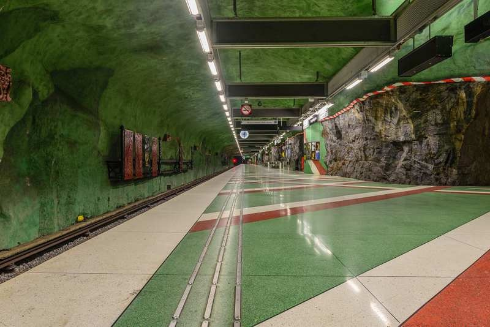

# 每周总结第7期.20180831

这里记录过去一周，我看到的值得记录的东西，每周五总结。

## 新闻

* [区块链版的今日头条来了？](https://www.ifanr.com/1093592): 8 月 29 日，一款主打区块链概念的内容平台「五条」正式全平台公测。和今日头条一样，五条是推荐内容平台，内容主要分为文字和视频两大类。有入驻的创作者告诉我们，五条的文章也是需要经过平台审核方能发布。
* [美国选举采用区块链](https://threadreaderapp.com/thread/1026603800365330432.html): 美国西弗吉尼亚州的中期选举，允许手机投票。选票数据记录在区块链上。这样的话，如果有人要偸改数据就很不容易。
* [苹果市值一个月内增加1400亿美元 相当于一个耐克或IBM](http://3g.donews.com/News/donews_detail/3018035.html): 自8月初市值突破1万亿美元以来，苹果已刷新了多项记录。截至目前，苹果股价在8月内已经连续第12次刷新记录。苹果股价本月的涨幅也将超过15%，成为自2012年2月份以来涨幅最大的一个月。当时，苹果市值还只有5056.7亿美元，与当时相比，苹果现在市值增长了110%。知名分析师郭明錤也曾在8月中旬发布报告称，隶属于苹果快速增长服务部门的AR智能眼镜和苹果汽车项目，将推动该公司的估值达到2万亿美元。
* [雀巢与星巴克完成71.5亿元美元的授权协议](https://www.huxiu.com/article/260018.html?f=wangzhan): 8月28日，雀巢和星巴克以71.5亿美元的价格完成合作交易，永久性授权雀巢在全球范围内星巴克咖啡店之外销售星巴克零售和餐饮产品。此外，还将有约500名星巴克员工加入到雀巢工作。
* [北京房租 哄抬涨价风波](http://finance.sina.com.cn/china/gncj/2018-08-19/doc-ihhxaafy6456644.shtml): 在国内有北漂、上漂、广漂，无数年轻人涌向那里，寻找自己的梦想，结果形成了一个类似"*漂"的特殊群体。我看到美国 [Salon](https://www.salon.com/2016/09/17/hacker-house-blues-my-life-with-12-programmers-2-rooms-and-one-21st-century-dream/) 杂志的一篇文章，关于旧金山普通程序员的生活。读完很有感触。硅谷不仅仅是光鲜亮丽的科技巨头，更多的是努力奋斗的普通程序员。
* [Babel 7.0](https://babeljs.io/blog/2018/08/27/7.0.0) 发布，一大更新就是提供了 TypeScript 支持。

## 教程

* [《Linux 系统管理的面试题》](https://github.com/trimstray/test-your-sysadmin-skills): 这个仓库收集了200+道服务器的面试题，涉及的面很广，着重考察基础知识。
* [机器学习100天教程](https://github.com/MachineLearning100/100-Days-Of-ML-Code): 100 Days of ML Coding 中文版
* [Java 面试的算法问题](http://www.codespaghetti.com/java-algorithms-questions/)（英文）: 本文讲解了 Java 面试经常遇到的各种算法问题。

## 工具

* [yarn](https://github.com/yarnpkg/yarn/): 快速、可靠、安全的依赖管理工具。Facebook、Google、Exponent 和 Tilde 联合推出了一个新的 JS 包管理工具 — Yarn，正如官方文档中写的，Yarn 是为了弥补 npm 的一些缺陷而出现的。[Yarn vs npm: Everything You Need to Know](https://www.sitepoint.com/yarn-vs-npm/)。
* [JSON : Placeholder](http://jsonplaceholder.typicode.com/): 一个免费的在线REST服务。我们在开发时可以使用它提供的地址测试下网络请求以及请求参数。或者当我们程序需要获取一些假数据、假图片时也可以使用它。或者想自己短时间搭建一个REST API，可以使用[json-server](https://github.com/typicode/json-server)。
* [蚂蚁金服的移动图标库 F2 开源了](https://github.com/antvis/f2)，支付宝钱包及很多图表，都是用它做的。
* [蓝湖](https://lanhuapp.com/?home): 蓝湖是我们的一位设计师引入的效率工具，用来连接设计师、产品经理和研发人员。产品经理可以基于蓝湖做交互原型，设计师可以完美展示自己的设计作品，工程师可以查看标注，切图，复刻实现最终的产品。
* [SimilarWeb 插件](https://threetempi.com/my-secret-guide-to-find-free-stats-about-any-tech-company/): 通过这个插件，你可以在访问某个网站时，直接查看它的统计数据，比如访问量、访问来源、每个用户的浏览时长等等。

## 资源

* [Unit History](https://www.levenez.com/unix/): 这份文档讲述了Unit的发展历史。
* [Swift 学习材料](https://www.hackingwithswift.com/): 免费的 Swift 学习材料，包括视频和代码练习，从零开始教起。
* [《Node.js 调试指南》](https://github.com/nswbmw/node-in-debugging): 《Node.js 调试指南》一书的开源版。
* [node best practices(node开发最佳实践)](https://github.com/i0natan/nodebestpractices): 一个收集 Node 最佳实践的仓库。

## 新奇

* [斯德哥尔摩最深的地铁站](https://www.atlasobscura.com/places/kungstradgarden-metro-station)

国王花园站（Kungsträdgården）是瑞典首都斯德哥尔摩最深的地铁站，地下34米。它的最大特点就是，车站大部分墙壁都是原始岩层，没有进行人工处理，而且岩壁上还保留着苔藓和真菌。

## 本周金句

* 有一个诀窍，让我成为一个更好的程序员，那就是我常常休息，大量的休息，我的新想法都是在休息时产生的。休息的时候，我阅读，大量阅读任何我有兴趣的内容，这样我才可能产生新想法。(原文: One trick that made me a better programmer/ speaker/ product person: rest, a lot. That's when ideas come. Read a lot, eclectically, about everything that interests you. That's where ideas come from. And wear groovy shirts.) *转自 推特*

