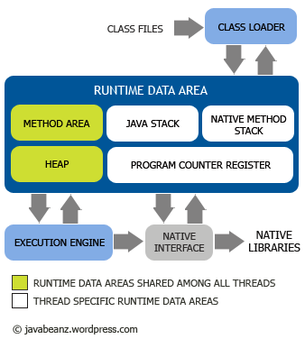

# 深入理解JVM01 - 自动内存管理机制

## 内存模型

下图是描述JVM内存模型的图:

JVM包含两个子系统和两个组件，两个子系统为Class loader(类装载)、Execution engine(执行引擎)；两个组件为Runtime data area(运行时数据区)、Native Interface(本地接口)。

Class loader(类装载): 根据给定的全限定名类名(如：java.lang.Object)来装载class文件到Runtime data area中的method area。

Execution engine（执行引擎）: 执行classes中的指令。

Native Interface(本地接口): 与native libraries交互，是其它编程语言交互的接口。

Runtime data area(运行时数据区): 这就是我们常说的JVM的内存。

* 程序计数器（Program Counter Register）: 一块较小的内存空间，它可以看作是当前线程所执行的字节码的行号指示器。
* Java虚拟机栈（Java Virtual Machine Stacks）: 是Java方法执行的内存模型：每个方法在执行的同时都会创建一个栈帧（Stack Frame[1]）用于存储局部变量表、操作数栈、动态链接、方法出口等信息。
* 本地方法栈（Native Method Stack）: 与虚拟机栈所发挥的作用是非常相似的，为虚拟机使用到的Native方法服务。
* Java堆（Java Heap）: 是Java虚拟机所管理的内存中最大的一块，唯一目的就是存放对象实例，几乎所有的对象实例都在这里分配内存。
* 方法区（Method Area）: 用于存储已被虚拟机加载的类信息、常量、静态变量、即时编译器编译后的代码等数据。
* 运行时常量池（Runtime Constant Pool）: 是方法区的一部分，Class文件中除了有类的版本、字段、方法、接口等描述信息外，还有一项信息是常量池（Constant Pool Table），用于存放编译期生成的各种字面量和符号引用，这部分内容将在类加载后进入方法区的运行时常量池中存放。
* 直接内存（Direct Memory）: 并不是虚拟机运行时数据区的一部分，也不是Java虚拟机规范中定义的内存区域。JDK 1.4中新加入了NIO（New Input/Output）类，引入了一种基于通道（Channel）与缓冲区（Buffer）的I/O方式，它可以使用Native函数库直接分配堆外内存，然后通过一个存储在Java堆中的DirectByteBuffer对象作为这块内存的引用进行操作。

Heap和Method Area是被所有线程的共享使用的；而Java stack, Program counter 和Native method stack是以线程为粒度的，每个线程独自拥有自己的部分。

## 对象探秘

#### 创建

下面是对象创建的主要流程:

虚拟机遇到一条new指令时，先检查常量池是否已经加载相应的类，如果没有，必须先执行相应的类加载。类加载通过后，接下来分配内存。若Java堆中内存是绝对规整的，使用“指针碰撞“方式分配内存；如果不是规整的，就从空闲列表中分配，叫做”空闲列表“方式。划分内存时还需要考虑一个问题-并发，也有两种方式: CAS同步处理，或者本地线程分配缓冲(Thread Local Allocation Buffer, TLAB)。然后内存空间初始化操作，接着是做一些必要的对象设置(元信息、哈希吗...)，最后执行<init>方法。

#### 内存布局

参考: https://www.jianshu.com/p/91e398d5d17c

* 对象在内存中存储的布局可以分为3块区域：对象头（Header）、实例数据（Instance Data）和对齐填充（Padding）。
* HotSpot虚拟机的对象头包括两部分信息，第一部分用于存储对象自身的运行时数据，如哈希码（HashCode）、GC分代年龄、锁状态标志、线程持有的锁、偏向线程ID、偏向时间戳等，这部分数据的长度在32位和64位的虚拟机（未开启压缩指针）中分别为32bit和64bit，官方称它为“Mark Word”。
* 对象头的另外一部分是类型指针，即对象指向它的类元数据的指针，虚拟机通过这个指针来确定这个对象是哪个类的实例。
* 实例数据部分是对象真正存储的有效信息，也是在程序代码中所定义的各种类型的字段内容。
* 第三部分对齐填充并不是必然存在的，也没有特别的含义，它仅仅起着占位符的作用。

#### 访问定位
* 主流的访问方式是使用句柄和直接指针两种。虚拟机Sun HotSpot而言，它是使用第二种方式进行对象访问的。

## 实战: OutOfMemoryError异常

## 实战

参考: 

* 《深入理解Java虚拟机: JVM高级特性与最佳实践》
* [JVM 必知必会](https://love2.io/@meiritugua/doc/jvm/JVM_jian_jie.md)

