# 深入理解JVM02 - 垃圾收集器与内存分配策略

垃圾收集（Garbage Collection,GC）需要完成的3件事情:

* 哪些内存需要回收？
* 什么时候回收？
* 如何回收？

JVM01介绍了Java内存运行时区域的各个部分，其中程序计数器、虚拟机栈、本地方法栈3个区域随着线程而生，随线程而灭；而Java堆和方法区则不一样，只有在程序处于运行时才能知道会创建哪些对象，这部分内存的创建和回收都是动态的，垃圾收集器所关注的是这部分内存。

## to be or not to be

确定对象”存活“还是”死去“。

#### 引用计数算法

给对象中添加一个引用计数器，每当有一个地方引用它时，计数器值就加1；当引用失效时，计数器值就减1； 

任何时刻计数器为0的对象就是不可能再被使用的，这时候变可通知GC收集器回收这些对象。


```java
public class ReferenceCountingGC {
　　
        public Object instance = null;

        public static void testGC(){

            ReferenceCountingGC objA = new ReferenceCountingGC ();
            ReferenceCountingGC objB = new ReferenceCountingGC ();

            // 对象之间相互循环引用，对象objA和objB之间的引用计数永远不可能为 0
            objB.instance = objA;
            objA.instance = objB;

            objA = null;
            objB = null;

            System.gc();
    }
}
```

上述代码最后面两句将objA和objB赋值为null，也就是说objA和objB指向的对象已经不可能再被访问，但是由于它们互相引用对方，导致它们的引用计数器都不为 0，那么垃圾收集器就永远不会回收它们。

> 但是Java虚拟机里面没有选用引用计数算法来管理内存，其中最主要的原因是它很难解决对象之间相互循环引用的问题。
> 
> 优点：简单，高效，现在的objective-c用的就是这种算法。 
> 缺点：很难处理循环引用，相互引用的两个对象则无法释放。（需要开发者自己处理）

#### 可达性分析算法

Java虚拟机中，是通过可达性分析（Reachability Analysis）来判定对象是否存活的。 

这个算法的基本思路是通过一系列称为“GC Roots”的对象作为起始点，从这些节点开始向下搜索，搜索所走过的路径称为引用链（Reference Chain），当一个对象到GC Roots没有任何引用链项链时，则证明此对象是不可用的。


GC Roots的对象:

* 虚拟机栈（栈帧中的局部变量表）中的引用对象
* 方法区中类静态属性（静态对象）引用的对象
* 方法区中常量（final 修饰的成员对象）引用的对象。
* 本地方法栈中JNI（Native）引用的对象。

## 引用

判定对象是否存活（需要回收）都与“引用”有关。Java对引用的概念扩充，将引用分为强引用（Strong Reference），软引用（Soft Reference），弱引用（Weak Reference），虚引用（Phantom Refernce）。

* **强引用** ： 类似Object obj=new Object()这类的引用，只要强引用还在，垃圾收集器永远不会回收掉被引用的对象。
* **软引用** ： 软引用是用来描述一些有用但非必须的对象，在系统将要发生内存溢出（OOM）异常之前，将会把这些对象列进回收范围之中进行二次回收。如果这次回收还没有足够的内存，才会抛出内存溢出（OOM）异常。JDK1.2之后提供了SoftReference类来实现软引用。
* **弱引用** ： 弱引用也是用来描述非必需对象的，但是它的引用比软引用更弱一些，被弱引用关联的对象只能生存到下一次垃圾收集发生之前。JDK1.2之后提供了SoftReference类来实现软引用。
* **虚引用** ： 虚引用也成为幽灵引用或者幻影引用，它是最弱的一种引用关系。无法通过虚引用来取得一个对象的实例。为一个对象设置虚引用的唯一目的就是能够在这个对象被回收的时候收到一个系统通知。

## 垃圾收集算法

#### 标记清除算法

标记-清除算法分为标记和清除两个阶段。该算法首先从根集合进行扫描，对存活的对象对象标记，标记完毕后，再扫描整个空间中未被标记的对象并进行回收，如下图所示:


标记-清除算法的主要不足有两个：

* **效率问题**：标记和清除两个过程的效率都不高;
* **空间问题**：标记-清除算法不需要进行对象的移动，并且仅对不存活的对象进行处理，因此标记清除之后会产生大量不连续的内存碎片，空间碎片太多可能会导致以后在程序运行过程中需要分配较大对象时，无法找到足够的连续内存而不得不提前触发另一次垃圾收集动作。

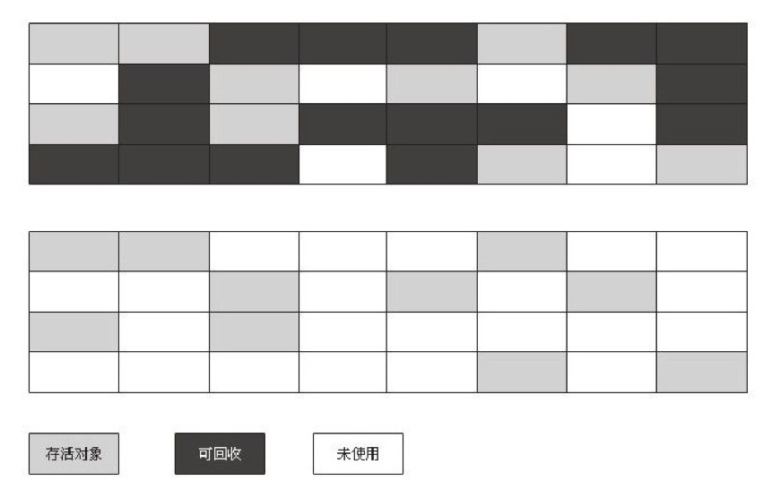


#### 复制算法

复制算法将可用内存按容量划分为大小相等的两块，每次只使用其中的一块。当这一块的内存用完了，就将还存活着的对象复制到另外一块上面，然后再把已使用过的内存空间一次清理掉。

这种算法适用于对象存活率低的场景，比如新生代。这样使得每次都是对整个半区进行内存回收，内存分配时也就不用考虑内存碎片等复杂情况，只要移动堆顶指针，按顺序分配内存即可，实现简单，运行高效。该算法示意图如下所示：

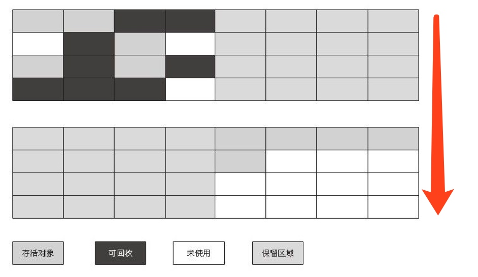

事实上，现在商用的虚拟机都采用这种算法来回收新生代。因为研究发现，新生代中的对象每次回收都基本上只有10%左右的对象存活，所以需要复制的对象很少，效率还不错。实践中会将新生代内存分为一块较大的Eden空间和两块较小的Survivor空间，每次使用Eden和其中一块Survivor。当回收时，将Eden和Survivor中还存活着的对象一次地复制到另外一块Survivor空间上，最后清理掉Eden和刚才用过的Survivor空间。HotSpot虚拟机默认Eden和Survivor的大小比例是 8:1，也就是每次新生代中可用内存空间为整个新生代容量的90% ( 80%+10% )，只有10% 的内存会被“浪费”。

#### 标记整理算法

复制收集算法在对象存活率较高时就要进行较多的复制操作，效率将会变低。更关键的是，如果不想浪费50%的空间，就需要有额外的空间进行分配担保，以应对被使用的内存中所有对象都100%存活的极端情况，所以在老年代一般不能直接选用这种算法。

标记整理算法的标记过程类似标记清除算法，但后续步骤不是直接对可回收对象进行清理，而是让所有存活的对象都向一端移动，然后直接清理掉端边界以外的内存，类似于磁盘整理的过程，该垃圾回收算法适用于对象存活率高的场景（老年代），其作用原理如下图所示。


标记整理算法与标记清除算法最显著的区别是：标记清除算法不进行对象的移动，并且仅对不存活的对象进行处理；而标记整理算法会将所有的存活对象移动到一端，并对不存活对象进行处理，因此其不会产生内存碎片。标记整理算法的作用示意图如下：

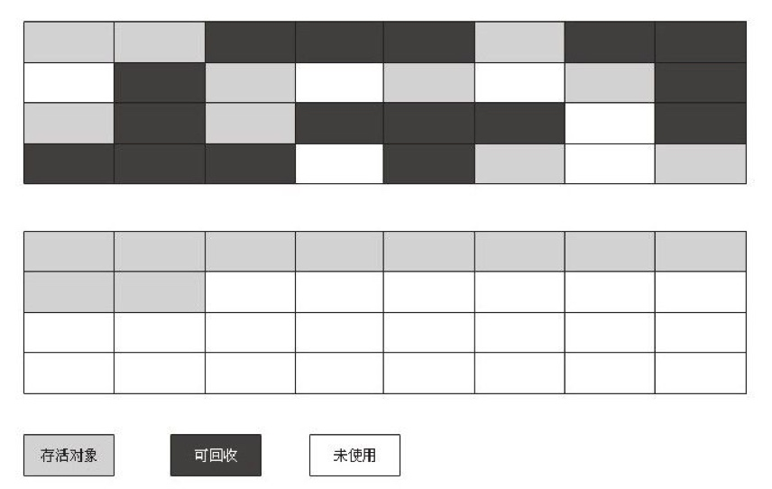

#### 分代收集算法

对于一个大型的系统，当创建的对象和方法变量比较多时，堆内存中的对象也会比较多，如果逐一分析对象是否该回收，那么势必造成效率低下。

分代收集算法是基于这样一个事实：不同的对象的生命周期(存活情况)是不一样的，而不同生命周期的对象位于堆中不同的区域，因此对堆内存不同区域采用不同的策略进行回收可以提高 JVM 的执行效率。

当代商用虚拟机使用的都是分代收集算法：新生代对象存活率低，就采用复制算法；老年代存活率高，就用标记清除算法或者标记整理算法。Java堆内存一般可以分为新生代、老年代和永久代三个模块，如下图所示：

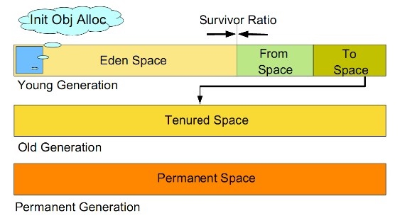

## GC算法小结


由于对象进行了分代处理，因此垃圾回收区域、时间也不一样。垃圾回收有两种类型，Minor GC 和 Full GC。

* Minor GC：对新生代进行回收，不会影响到年老代。因为新生代的 Java 对象大多死亡频繁，所以 Minor GC 非常频繁，一般在这里使用速度快、效率高的算法，使垃圾回收能尽快完成。
* Full GC：也叫 Major GC，对整个堆进行回收，包括新生代和老年代。由于Full GC需要对整个堆进行回收，所以比Minor GC要慢，因此应该尽可能减少Full GC的次数，导致Full GC的原因包括：老年代被写满、永久代（Perm）被写满和System.gc()被显式调用等

## 垃圾收集器

如果说垃圾收集算法是内存回收的方法论，那么垃圾收集器就是内存回收的具体实现。下图展示了7种作用于不同分代的收集器，其中用于回收新生代的收集器包括Serial、PraNew、Parallel Scavenge，回收老年代的收集器包括Serial Old、Parallel Old、CMS，还有用于回收整个Java堆的G1收集器。不同收集器之间的连线表示它们可以搭配使用。

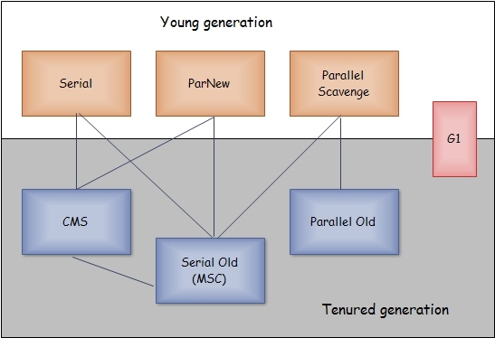

* Serial收集器（复制算法): 新生代单线程收集器，标记和清理都是单线程，优点是简单高效；
* ParNew收集器 (复制算法): 新生代收并行集器，实际上是Serial收集器的多线程版本，在多核CPU环境下有着比Serial更好的表现；
* Parallel Scavenge收集器 (复制算法): 新生代并行收集器，追求高吞吐量，高效利用 CPU。吞吐量 = 用户线程时间/(用户线程时间+GC线程时间)，高吞吐量可以高效率的利用CPU时间，尽快完成程序的运算任务，适合后台应用等对交互相应要求不高的场景；
* Serial Old收集器 (标记-整理算法): 老年代单线程收集器，Serial收集器的老年代版本；
* Parallel Old收集器 (标记-整理算法)： 老年代并行收集器，吞吐量优先，Parallel Scavenge收集器的老年代版本；
* CMS(Concurrent Mark Sweep)收集器（标记-清除算法）： 老年代并行收集器，以获取最短回收停顿时间为目标的收集器，具有高并发、低停顿的特点，追求最短GC回收停顿时间。
* G1(Garbage First)收集器 (标记-整理算法)： Java堆并行收集器，G1收集器是JDK1.7提供的一个新收集器，G1收集器基于“标记-整理”算法实现，也就是说不会产生内存碎片。此外，G1收集器不同于之前的收集器的一个重要特点是：G1回收的范围是整个Java堆(包括新生代，老年代)，而前六种收集器回收的范围仅限于新生代或老年代。

## GC日志解读

```
33.125：[GC [DefNew：3324K-＞152K（3712K），0.0025925 secs]3324K-＞152K（11904K），0.0031680 secs]
100.667：[Full GC [Tenured：0K-＞210K（10240K），0.0149142secs]4603K-＞210K（19456K），[Perm：2999K-＞2999K（21248K）]，0.0150007 secs][Times：user=0.01 sys=0.00，real=0.02 secs]
```

* 最前面的“33.125：”和“100.667：" 代表了GC发生时间（从java虚拟机启动以来经过的秒数）。
* 日志开头“[GC ”和“[Full GC”说明了这次垃圾收集的停顿类型。有"Full"说明这次GC是发生了Stop-The-World的。一般因为出现了分配担保失败之类的问题才会导致STW。如果调用System.gc()方法所触发的收集，那么这里将显示“[Full GC(System)”。
* “ [DefNew”、“[Tenured”、“[Perm”表示GC发生区域，这里显示区域名称与使用的GC收集器密切相关，，例如上面样例所使用的Serial收集器中的新生代名为“Default New Generation”，所以显示的是“[DefNew”。如果是ParNew收集器，新生代名称就会变为“[ParNew”，意为“Parallel New Generation”。如果采用Parallel Scavenge收集器，那它配套的新生代称为“PSYoungGen”，老年代和永久代同理，名称也是由收集器决定的。
* 后面方括号内部的“3324K-＞152K（3712K）”含义是“GC前该内存区域已使用容量-＞GC后该内存区域已使用容量（该内存区域总容量）”。而在方括号之外的“3324K-＞152K（11904K）”表示“GC前Java堆已使用容量-＞GC后Java堆已使用容量（Java堆总容量）”。
* 再往后，“0.0025925 secs”表示该内存区域GC所占用的时间，单位是秒。
* 有的收集器会给出更具体的时间数据，如“[Times：user=0.01 sys=0.00，real=0.02 secs]”，这里面的user、sys和real与Linux的time命令所输出的时间含义一致，分别代表用户态消耗的CPU时间、内核态消耗的CPU时间和操作从开始到结束所经过的墙钟时间（Wall Clock Time）。
* CPU时间与墙钟时间的区别是，墙钟时间包括各种非运算的等待耗时，例如等待磁盘I/O、等待线程阻塞，而CPU时间不包括这些耗时，但当系统有多CPU或者多核的话，多线程操作会叠加这些CPU时间，所以读者看到user或sys时间超过real时间是完全正常的。

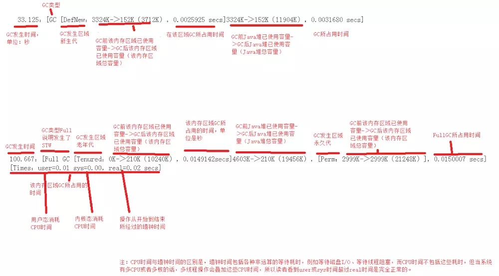

> 新生代GC（Minor GC）：指发生在新生代的垃圾收集动作，因为Java对象大多都具备朝生夕灭的特性，所以Minor GC非常频繁，一般回收速度也比较快。
老年代GC（Major GC/Full GC）：指发生在老年代的GC，出现了Major GC，经常会伴随至少一次的Minor GC（但非绝对的，在Parallel Scavenge收集器的收集策略里就有直接进行Major GC的策略选择过程）。Major GC的速度一般会比Minor GC慢10倍以上。

## 3.5.9　垃圾收集器参数

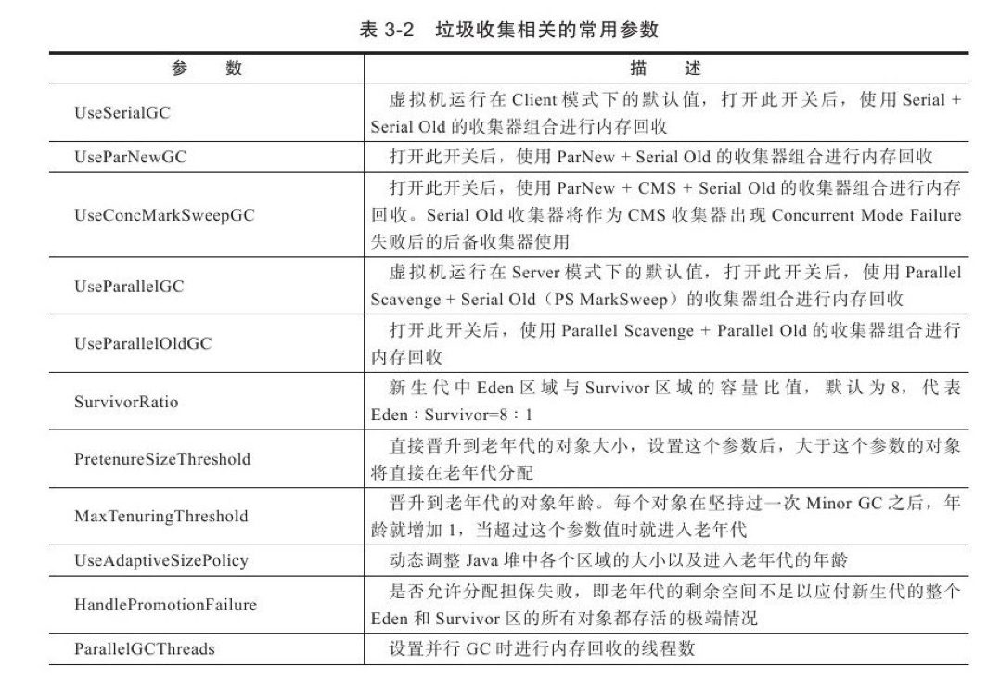

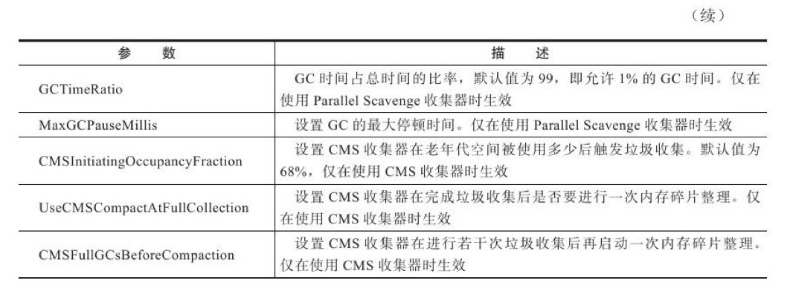

## 内存分配与回收策略

#### 新生代Minor GC

回顾下垃圾回收算法，通常新生代按照8:1:1(eden space + survivor from space + survivor to space)进行内存划分，新生产的对象会被放到eden space，当eden内存不足时，就会将存活对象移动到survivor区域，如果survivor空间也不够时，就需要从老年代中进行分配担保，将存活的对象移动老年代，这就是一次Minor GC的过程。

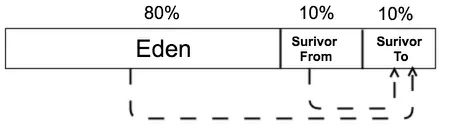

```java
/**
 * VM agrs: -verbose:gc -Xms20M -Xmx20M -Xmn10M -XX:+PrintGCDetails
 * -XX:SurvivorRatio=8 -XX:+UseSerialGC
 */

public class MinorGCTest {
    private static final int _1MB = 1024 * 1024;

    public static void testAllocation() {
        byte[] allocation1, allocation2, allocation3, allocation4;
        allocation1 = new byte[2 * _1MB];
        allocation2 = new byte[2 * _1MB];
        allocation3 = new byte[2 * _1MB];
        allocation4 = new byte[4 * _1MB];
    }

    public static void main(String[] agrs) {
        testAllocation();
    }
}
```

代码清单的testAllocation()方法中，尝试分配3个2MB大小和1个4MB大小的对象，在运行时通过-Xms20M、-Xmx20M、-Xmn10M这3个参数限制了Java堆大小为20MB，不可扩展，其中10MB分配给新生代，剩下的10MB分配给老年代。-XX：SurvivorRatio=8决定了新生代中Eden区与一个Survivor区的空间比例是8:1，从输出的结果也可以清晰地看到“eden space 8192K、from space 1024K、to space 1024K”的信息，新生代总可用空间为9216KB（Eden区+1个Survivor区的总容量）。

before MinorGC:

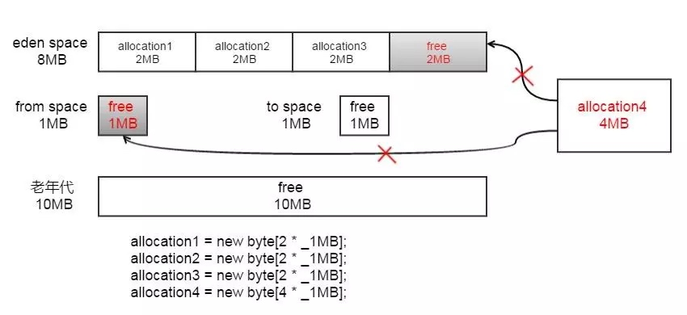

after MinorGC:

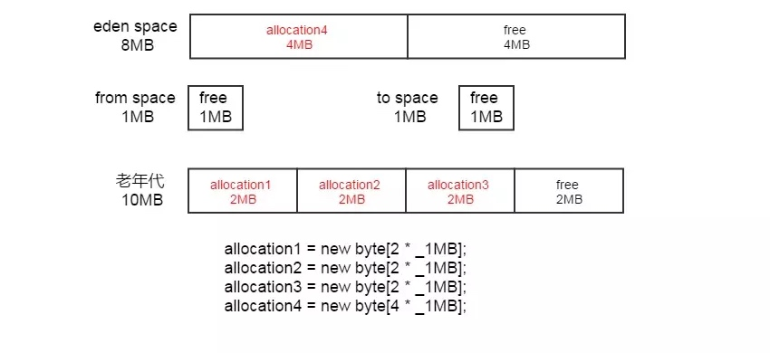

GC日志:

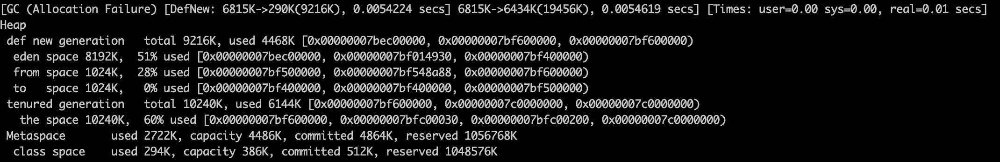

解读: [GC (Allocation Failure) [DefNew: 6815K->290K(9216K), 0.0054224 secs] 6815K->6434K(19456K), 0.0054619 secs] [Times: user=0.00 sys=0.00, real=0.01 secs]

* GC 表明进行了一次垃圾回收，前面没有Full修饰，表明这是一次Minor GC ,注意它不表示只GC新生代
* Allocation Failure: 表明本次引起GC的原因是因为在年轻代中没有足够的空间能够存储新的数据了。
* DefNew: 使用的是Serial收集器，它的新生代名为“Default New Generation”。
* 6815K->290K(9216K): GC前该内存区域(这里是年轻代)使用容量，GC后该内存区域使用容量，该内存区域总容量。
* 0.0054224 secs: 该内存区域GC耗时，单位是秒
* 6815K->6434K(19456K): 三个参数分别为：堆区垃圾回收前的大小，堆区垃圾回收后的大小，堆区总大小。
* 0.0054619 secs: 该内存区域GC耗时，单位是秒
* Times: user=0.00 sys=0.00, real=0.01 secs: 分别表示用户态耗时，内核态耗时和总耗时

结论:

* eden space 8192K,  51% used ==> 新生代的Eden区总共大小为8MB，使用掉的4MB是用来存放allocation4对象
* tenured generation   total 10240K, used 6144K ==> 老年代大小为10MB，使用掉的6MB是用来存放allocation1、allocation2和allocation3这3个对象

#### 大对象直接进入老年代

创建了一个数组对象allocation，大小为4MB，已经超出PretenureSizeThreshold设置的范围，该对象将直接被分配到老年代中。

```java
/**
 * VM agrs: -verbose:gc -Xms20M -Xmx20M -Xmn10M -XX:+PrintGCDetails
 * -XX:SurvivorRatio=8 -XX:+UseSerialGC      
 * -XX:PretenureSizeThreshold=3145728
 */

public class TestClass2 {
    private static final int _1MB = 1024 * 1024;
    
    public static void testPretenureSizeThreshold() {
        byte[] allocation;
        allocation = new byte[4 * _1MB];
    }
    /**
     * @param args
     */
    public static void main(String[] args) {
        // TODO Auto-generated method stub
        testPretenureSizeThreshold();
    }

}
```

> VM参数说明:
> -XX:PretenureSizeThreshold=3145728 表示 所占用内存大于该值的对象直接分配到老年代，3145728为3MB

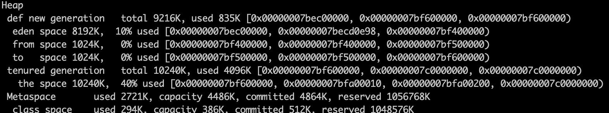

解读: 上述log中未发生GC垃圾回收，同时tenured generation   total 10240K, used 4096K，说明老年代大小为10MB，用掉的4MB用来存放allocation对象，即大对象直接进入老年代。

#### 长期存活的对象进入老年代

创建了3个数组对象，当执行到"allocation3 = new byte[4 * _1MB]; "时，Eden已经被占用了256KB + 4MB，而创建allocation3需要4MB，已经超过Eden的大小8MB，需要先发生一次MinorGC，才能保证有空间存放allocation3。

```java
/**
 * VM agrs: -verbose:gc -Xms20M -Xmx20M -Xmn10M -XX:+PrintGCDetails
 * -XX:SurvivorRatio=8 -XX:+UseSerialGC -XX:MaxTenuringThreshold=1
 */

public class TestClass3 {
    private static final int _1MB = 1024 * 1024;

    public static void testTenuringThreshold() {
        byte[] allocation1, allocation2, allocation3;
        allocation1 = new byte[_1MB / 4];
        allocation2 = new byte[4 * _1MB];
        allocation3 = new byte[4 * _1MB];
        allocation3 = null;
        allocation3 = new byte[4 * _1MB];
    }

    public static void main(String[] agrs) {
        testTenuringThreshold();
    }
}
```

> VM参数说明:
> -XX:MaxTenuringThreshold=1 表示 对象晋升为老年代的年龄阀值为1

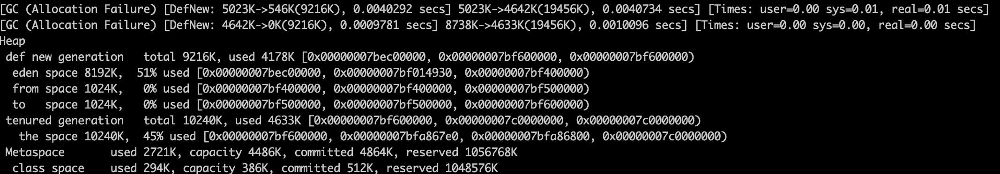

说明: 

该段代码创建了3个数组对象，当执行到"allocation3 = new byte[4 * _1MB]; "时，Eden已经被占用了256KB + 4MB，而创建allocation3需要4MB，已经超过Eden的大小8MB，需要先发生一次MinorGC，才能保证有空间存放allocation3

解读:

* 由GC日志开头的两句"[GC [DefNew"可知，该段代码一共发生了2次GC，第一次是"allocation3 = new byte[4 * _1MB]; "，第二次是执行allocation3 = null时
* allocation1在经过第一次GC时，对象年龄变成了1，由于设置的MaxTenuringThreshold=1，当发生第二次GC时，allocation1的年龄已经超出了设置的阀值，allocation1进入到老年代，因此，新生代的from space使用空间为0，对应GC语句为from space 1024K, 0% used

若将MaxTenuringThreshold改成15(注: 设置下-XX:TargetSurvivorRatio=90)，GC log为:

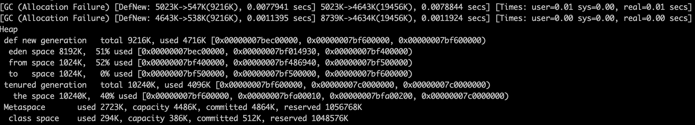

即 新生代的from space使用空间不为0，对应GC语句为from space 1024K, 52% used

## 参考

深入理解Java虚拟机：JVM高级特性与最佳实践（第2版）

