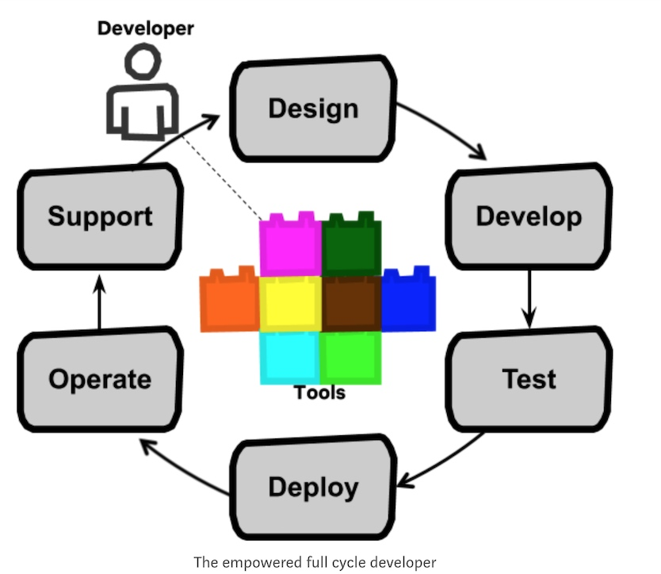

# 2018，在这奋斗的一年里

年度关键字: 担当

又到了一年一度的年度总结，2018年，总体上都按照年初的规划，尝试了一些新的东西，跳出自己的舒适区，看看外面发生的新鲜事，挑战自己的技术栈，同时职位上的调整更让我得到了一次挑战机会，拓展了工作领域，从一个技术实践者渐渐走向一位技术管理者，开始担当起一个团队的责任(带”团队“)，进入一个”自己不知道“的领域，很好奇，希望自己保持这份责任感、好奇心、执行力，和小伙伴们一起打造一个朝气蓬勃的团队。

## 养成‘科技’收集癖

一件很惊喜的工作，受阮一峰的每周总结影响，于7月初开始，[记录每周我看到的值得记录的东西，并在周五总结、发布](https://github.com/linlicro/blog/tree/master/%E5%B0%8F%E9%81%93%E6%B6%88%E6%81%AF)。作为一名软件开发，围绕着科技新闻、技术教程、软件工具，在2018年下半年一共做了24期，有新闻、教程、资料、工具、新奇等几个主题，100+的教程，100+的工具收录，收集、整理、发布、回顾一系列工作养成习惯，2019年希望自己依然保持这个收集癖，并且进一步推向公众，形成一个「相互分享」的圈子。

## 工作

依然在大树，第3年，30岁，往3个方向做出了突破，进行了0到1的探索和实践。

* 大前端方向: 进入公司后，一直做着服务后端工作，在保障公司业务服务作业的情况下，向大前端迈出了第一步，以「功夫贷业务辅助系统」为项目场景，顺利的完成了「Vars」(风控变量业务口径的快查)、「名单管理」的前端工作；
* 管理方面: 一个技术实践者渐渐走向一位技术管理者，团队6人。作为管理者，慢慢地开始搭建[团队Wiki](http://confluence.treefinance.com.cn/pages/viewpage.action?pageId=3407949)。挺好奇我能做成怎么样的团队，保持着这份责任感、好奇心，希望19年和小伙伴们一起打造一个朝气蓬勃的团队。
* 业务领域: 我更擅长的是风控业务领域，18年跳出了这个舒适区，往App端、产品运营、技术架构方面尝试，App端-担任起功夫贷业务网关负责人，建立起完整的网关api文档，需做到前后端完全独立开发；产品运营-利用「数据回收」，通过数据分析结果优化/迭代功能；技术架构-监控方向，做了不少尝试/试验，从最简略的hard code发送错误log邮件，到接入大众的CAT开源监控系统，然后补充使用Zipkin分布式跟踪系统，这样看似完美了，后面又接入了阿里云日记服务。监控方面，产品方面覆盖面挺全了，接下来，需要沉淀一些实时的、精准的、准确的监控指标，来升华、完善这套生产监控体系。

总体上，19年想成为一名全周期开发者(Netflix的定义 -- Full Cycle Developer)，还需要在产品运营、产品测试、业务辅助上做更多的尝试。

## 生活

家庭上，”担当“，更多的还有"包容"。三十而立，担当起一家子的责任；也因工作性质的原因，得到很多家人的包容 -- 一万个谢谢老婆，19年，需要我更多地照顾你。
旅游方面，去了趟新西兰，第一次跑这么远，100%自由行(自驾)，100%英语交流。再一次感受到了英语的重要性(上一次是在日本熊野古道徒步)，望19年再次再次学学英语: )。19年目标去冰岛、或者某个欧洲小国，生娃的话，就呆家里啦。

## 其他

18年在运动上投入了很多时间和金钱，还挑战了杭百42公里越野赛，给出了一份满意的成绩。19年，需要自己再接再厉，望自己来年能完成50+公里的比赛。
另外，想爬个富士山，或者徒步新西兰15天，或者稻城亚丁 -- 立个flag!

附. Full Cycle Developer

