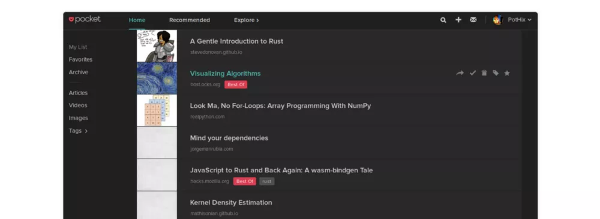
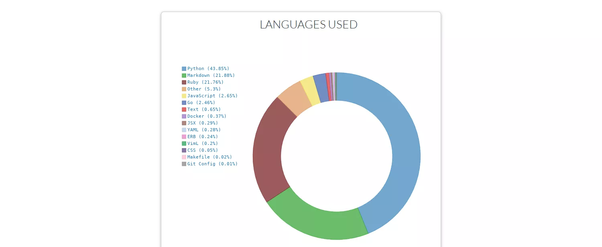

# 一套量化自己工具集合: 衡量每一份努力

18年初，开始追踪自己的做了什么，不仅仅是工作上，还需全面覆盖24小时。为了知道

* 我比上一周/上个月提升了多少？
* 持续在某方面投入，方便衡量投入产出效果
* 计算我在哪些事情上花了多少时间，又是不重要的事情
* 我平时的行为是不是一直在通往目标的路上

刚开始完全手动记录，就跟[《奇特的一生》](https://book.douban.com/subject/1115353/)里描述的一样，但很难坚持，尤其你要记录的东西很多，慢慢的为记录数据花费的时间成本很大。

为追求‘全自动化’追踪记录，并自动生成报表，开始不断收集App来完成日常的记录。下面罗列出我目前在用的，覆盖阅读、电影、时间花费、位置(去过哪)、目标(任务)、健康、收入支出。(注: 会给服务商提供你的隐私数据，比如位置、行为、喜好等，不喜误入)

#### 阅读: 书籍和文章

* [豆瓣读书](https://book.douban.com/)
* [getpocket](https://getpocket.com/a/)

豆瓣读书不多介绍了，方便记录你读过的、想读和正在读的书,顺便打分,添加标签及个人附注,写评论。根据你的口味,推荐适合的书给你。

getpocket是网页阅读应用稍后阅读工具，很适合记录你想读和读过的文章。多平台同步&脱机网页阅读工具，可以将你的想看的文章标记为稍后再读，尤其是在你每天都要接收大量阅读信息的时候，该服务会非常有用。

getpocket的统计是一个问题，产品没有提供统计，也没有其他第三方app提供类似的功能。下一步(因为我一名程序员:))，将通过开放的api，编写代码来做个人的数据统计。

#### 电影

* [豆瓣电影](https://movie.douban.com/): 提供最新的电影介绍及评论包括上映影片的影讯查询及购票服务。你可以记录想看、在看和看过的电影电视剧，顺便打分、写影评。根据你的口味，豆瓣电影会推荐好电影给你。

#### 音乐

* [豆瓣FM](https://douban.fm/): 是一款由豆瓣开发的个性化的音乐收听工具。它可以根据用户的喜好，自动发现并且播出符合用户音乐口味的歌曲。

#### 时间

* [Life Cycle](https://itunes.apple.com/cn/app/life-cycle-chart-your-life/id1064955217?mt=8)

Life Cycle 是一款时间记录工具，它最大的特色就是自动记录你一天的时间分配。
你不需要额外打开 app，它会默默地在后台，一直记录着你这一天的时间分配。依据 WiFi、地理位置和时间来智能地猜测你在做什么。

#### Coding的时间

我的工作主要是Coding为主，为了跟踪具体的编码时间 - IDE用了多少时间；使用某种开发语言开发了多久等，这里我使用Wakatime，一款记录 coding 时间的工具，只需在常使用的IDE里安装相应的插件就会全自动的统计你的编码时间。

#### 电脑使用时间

* [Recess](http://imacami.net/#rss): 一款MacOS平台上的健康软件，RecessMac版可以提醒长期坐在电脑前工作的用户适时休息，保持身体的健康状态，同时还提供电脑使用时间统计。

#### 手机使用时间

* iPhone自带的

#### 位置

* [世界迷雾](https://itunes.apple.com/cn/app/%E4%B8%96%E7%95%8C%E8%BF%B7%E9%9B%BE/id505367096?mt=8)

世界迷雾会告诉你你自己都去了哪里，灵感来自即时战略游戏中的战争迷雾，未达到的区域地图以迷雾展现，而造访过的地方则解开了迷雾。

#### 目标/日常任务

* [todoist](https://todoist.com/): 一个简洁的任务管理系统。

#### 健康

* 步数 - iPhone, 佳明手表、weChat
* 睡眠 - iPhone, 佳明手表

墙裂推荐使用佳明手表来记录你的运动: 步数、跑步、骑车、游泳等。

#### 收支

* 随手记: 一个移动互联理财平台，我只用来记账。不多介绍了，比较常用的一款软件。目前的缺点就是，基本全手动记录收支，未实现全自动化。

## 一丢丢思考

通过跟踪数据，您可以完全地了解实际花费时间的方式（而不是您认为自己花费的时间），这不是对过去行为的责备或内疚。 这是关于下个月注意到模式并做出有意识的决定。 它让你有机会成为一个更好的人 - 无论你看起来像什么。

知道你正在以一种有形的、可衡量的方式将你的生活与你的价值观和优先事项结合起来，这也让我感觉很好。

## 下一步: 整合分析

现在我已经从各方面记录了我的各种原始数据，以及一些第三方提供的各类报表，初步满足了我的基本需求，只是还没有做进一步的全面整合和关联分析。接下来，开始研究各类app/工具的开放api，希望自己能把所有源数据收集在同一地方，这个数据也应该归属于用户自己，最终形成一个个人数据银行，然后个性化分析展示报表：）

